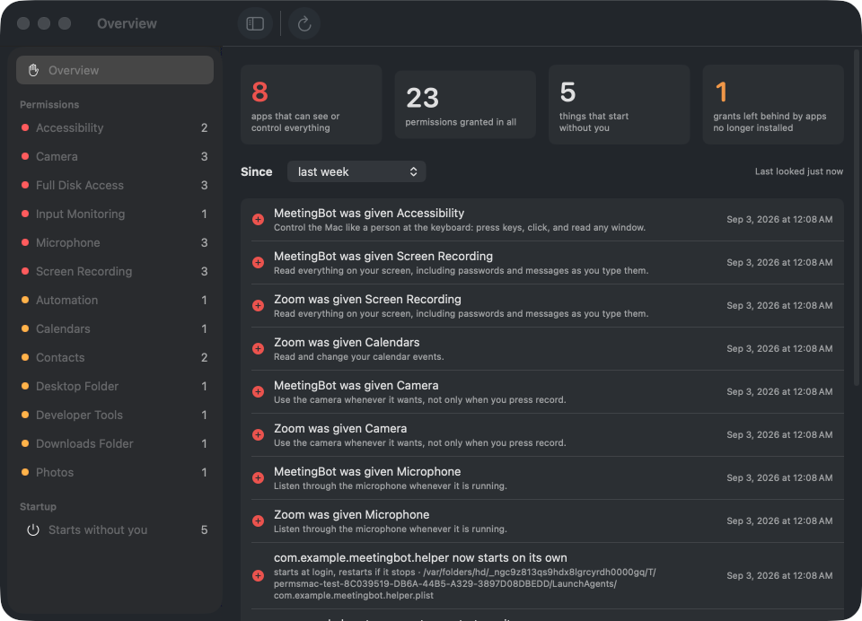
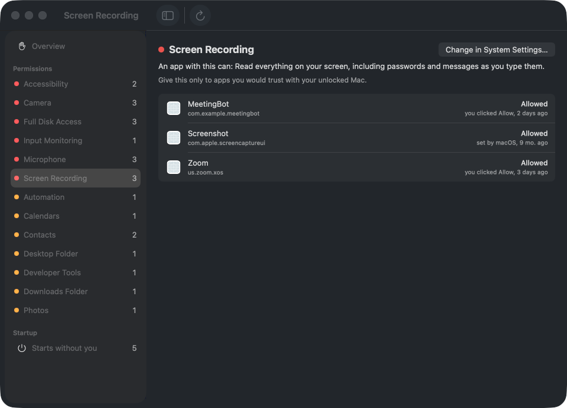

# Permissions for Mac

Every permission on your Mac on one screen, in plain English, with what changed since last week.

Camera, microphone, screen recording, keyboard, files, contacts, automation, and everything that starts without you. Each one with a sentence that says what an app holding it can actually do, and a button to the exact System Settings pane. It never changes a permission for an app you have.

## Download

**[Download Permissions-for-Mac-1.1.2.dmg](https://github.com/keithadler/permsmac/releases/latest/download/Permissions-for-Mac-1.1.2.dmg)** (macOS 14 or later, Apple Silicon and Intel)

Open the DMG, drag the app to Applications, open it. The first time, macOS says the app is from an unidentified developer: right-click the app, choose Open, then Open again. That is once.

When the app asks for Full Disk Access, that is the one permission it needs: macOS keeps the list of what every app may do in a file only apps with that access can read. Turn it on in the pane it opens, come back, and the window fills in. Nothing in the app writes to that file; there is no code path that could.



## What it does

- **One list.** Every permission macOS tracks, grouped by what it lets an app do, most sensitive first. Apps you have removed but that still hold a permission are marked, and one click clears those leftovers with Apple's own `tccutil`, only for apps that no longer exist on disk.
- **Plain English.** "Read everything on your screen, including passwords and messages as you type them." Not "Screen Recording".
- **What changed.** Each time it looks it keeps a small record. The overview shows what was granted, refused or removed since yesterday, last week, or last month, and a notification arrives when an app gains a permission that can see or control everything.
- **Startup.** Launch agents, launch daemons and login helpers, with when they run and what they start. No permission needed for this part.
- **One click to the switch.** Every row opens the right System Settings pane. The app never flips a switch itself.
- **A real command line.** `permsmac list`, `permsmac changes --since 7d` (exit 1 when something changed, so it fits in a script), `permsmac startup`, `permsmac orphans` (`--commands` prints the tccutil lines, `--clean` runs them), all with `--json`.



## Command line

```
ln -s "/Applications/Permissions for Mac.app/Contents/MacOS/PermsMac" /usr/local/bin/permsmac
permsmac list --service camera
permsmac changes --since 30d
permsmac explain accessibility
permsmac open "full disk access"
```

The command reads the same database, so the process running it needs Full Disk Access too: the app has it once you grant it; Terminal needs its own grant.

## For fleets

No MDM shows which apps your users have granted Screen Recording, Accessibility, Full Disk Access or the microphone. The command line does, and it was written to run from one.

- **Run as root** (the way an MDM agent runs), `list`, `changes` and `audit` read every account under `/Users` and tag each grant with its user. `--user <name>` limits it. The agent already has Full Disk Access, so nothing needs granting.
- **Every JSON document** carries `host`, `user`, `when` and `version`, so a thousand outputs merge into one table.
- **`permsmac audit policy.json`** checks the Mac against a written policy: which apps may hold each permission (globs like `com.apple.*`), whether leftovers from removed apps are allowed, and which launch agents may start on their own. Exit 0 when compliant, 1 with a list of violations, 2 when it could not check. `permsmac audit --example` prints a starter policy.
- **Ready scripts** in [docs/fleet](docs/fleet): a Jamf Pro extension attribute, a JumpCloud command, and the example policy.

```
sudo permsmac audit /Library/Management/permissions-policy.json
sudo permsmac changes --since 1d --json
sudo permsmac list --service "screen recording" --json
```

The binary is ad-hoc signed. Packages an MDM installs are not subject to Gatekeeper, but if your security review wants a Developer ID signature, say so in an issue.

## What it does not do

- It does not change a permission for an app you have. Apple only allows that through System Settings. The one exception is Clean Up, which clears entries left behind by apps that no longer exist, using Apple's `tccutil`, only when you click. Because `tccutil` refuses a name that is not on disk, Clean Up briefly registers an empty placeholder bundle with that name inside its own Application Support folder for the length of the call, then removes it.
- It does not see Location Services or Local Network in detail; macOS keeps those elsewhere, readable only by root.
- It does not phone home. No analytics, no server, no account. The update check asks GitHub once a day for the latest version number and can be turned off.

## Building

```
./build-app.sh --install      # universal build, ad-hoc signed, into /Applications
permsmac selftest             # 26 cases without Xcode
swift test                    # the same cases through XCTest, with Xcode
tests/integration.sh          # the command line, end to end, against a synthetic database
```

MIT licensed. See [PRIVACY.md](PRIVACY.md) and [CONTRIBUTING.md](CONTRIBUTING.md).

## More from the same maker

Three more small apps built the same way: each does one thing, says exactly what it touches, and never phones home. Free, MIT licensed, no accounts. All four at [keithadler.github.io](https://keithadler.github.io).

- [Clip for Mac](https://github.com/keithadler/clipmac): a clipboard that remembers, with a stack you paste through one item at a time, and that refuses to record passwords.
- [Tidy for Mac](https://github.com/keithadler/tidymac): cleanup and speed for the whole family; nothing is deleted, only moved to the Trash with an undoable receipt.
- [Stash for Mac](https://github.com/keithadler/stashmac): encrypted backup into storage you already have; the provider only ever sees ciphertext.
